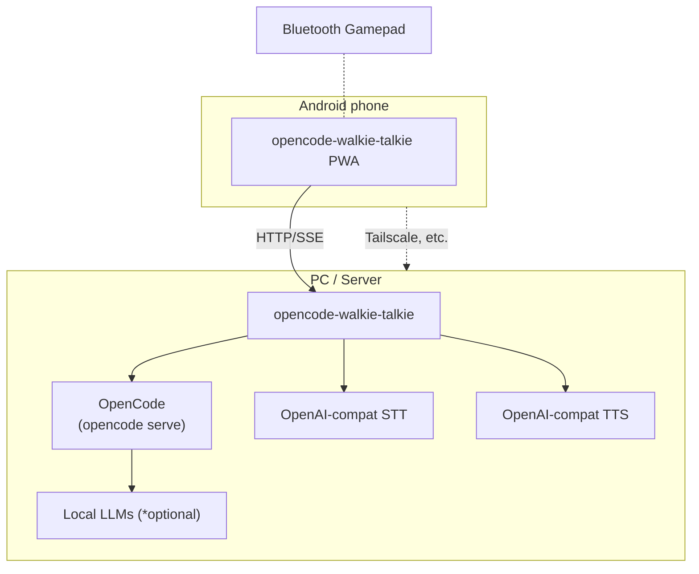

<p align="center">
  
</p>

# OpenCode Walkie Talkie

Yet another voice interface for OpenCode.

https://github.com/user-attachments/assets/19ce5e46-19fd-4295-b8a6-5abe7b6a42a5

https://github.com/user-attachments/assets/7c91895e-4224-428e-8450-68b2bc5f800e

**NOTE: This is a totally vibe-coded, personal experimental project.**

- Push-to-talk voice input with Bluetooth gamepad support
- Runs locally with real-time STT transcription and TTS playback (w/ Whisper, Kokoro, etc.)
- PWA for mobile with wake lock / screen lock

## Architecture



## Quick Start (Docker)

```bash
export OPENCODE_SERVER_PASSWORD=random-password
# Listen on 0.0.0.0, or specify the IP of docker0 interface instead
opencode serve --host 0.0.0.0
```

### Minimal (App only, bring your own STT/TTS)

**Note:** For LAN access (e.g., smartphones), HTTPS is required for microphone access. Use the SSL proxy below.

```bash
curl -O https://github.com/likeablob/opencode-walkie-talkie/raw/refs/heads/main/.env.example

cp .env.example .env
editor .env

cat << 'EOF' > compose.yaml
services:
  app:
    image: ghcr.io/likeablob/opencode-walkie-talkie:latest
    ports:
      - "127.0.0.1:5097:5097"
    env_file:
      - .env
    environment:
      - PORT=5097
      - OPENCODE_URL=http://host.docker.internal:4096
    extra_hosts:
      - "host.docker.internal:host-gateway"
    restart: unless-stopped
    logging:
      driver: "json-file"
      options:
        max-size: "10m"
        max-file: "3"
EOF

docker compose up -d
```

```bash
# Local SSL proxy for HTTPS access (no PWA available)
npx local-ssl-proxy@2.0.5 --source 5443 --target 5097

# Or with Cloudflare Quick Tunnel
# CAUTION: This exposes your server to the public internet.
uvx cqw -f localhost:5097
... # QR code will be shown
```

### Full (App + [Speaches](https://github.com/speaches-ai/speaches) STT + TTS server)

- See [compose.full.yaml](compose.full.yaml).
- NOTE: This requires NVIDIA GPU for CUDA.

```bash
curl -O https://github.com/likeablob/opencode-walkie-talkie/raw/refs/heads/main/compose.full.yaml
curl -O https://github.com/likeablob/opencode-walkie-talkie/raw/refs/heads/main/.env.example

cp .env.example .env
# Update .env:
#  OPENAI_STT_MODEL=Systran/faster-whisper-large-v3
#  OPENAI_STT_LANGUAGE=en
#  OPENAI_TTS_MODEL=speaches-ai/Kokoro-82M-v1.0-ONNX
#  OPENAI_TTS_VOICE=af_heart
editor .env

docker compose -f compose.full.yaml up -d

# Download models for speaches (STT, TTS)
SPEACHES_BASE_URL=http://localhost:8000 uvx speaches-cli model download Systran/faster-whisper-large-v3
SPEACHES_BASE_URL=http://localhost:8000 uvx speaches-cli model download speaches-ai/Kokoro-82M-v1.0-ONNX
```

- For SSL setup, refer to the [Minimal](#minimal-app-only) section above.
- See also https://speaches.ai/ for Speaches usage.

#### Full - Japanese (App + Speaches STT + [AivisSpeech Engine](https://github.com/Aivis-Project/AivisSpeech-Engine) for Japanese TTS)

- See [compose.full.ja.yaml](compose.full.ja.yaml).
- NOTE: This requires NVIDIA GPU for CUDA.

```bash
curl -O https://github.com/likeablob/opencode-walkie-talkie/raw/refs/heads/main/compose.full.ja.yaml
curl -O https://github.com/likeablob/opencode-walkie-talkie/raw/refs/heads/main/.env.example

cp .env.example .env
# Update .env
#  OPENAI_STT_MODEL=Systran/faster-whisper-large-v3
#  OPENAI_STT_LANGUAGE=ja
#  OPENAI_TTS_VOICE=auto
editor .env

docker compose -f compose.full.ja.yaml up -d

# Download models for speaches (STT)
SPEACHES_BASE_URL=http://localhost:8000 uvx speaches-cli model download Systran/faster-whisper-large-v3
```

- For SSL setup, refer to the [Minimal](#minimal-app-only) section above.

## Configuration

See [.env.example](.env.example) for configuration options.

## Development

```bash
# Install tools
mise trust .
mise install

# Install git hooks
pre-commit install

# Install dependencies
npm ci

# Run development server
npm run dev

# Run Storybook server
npm run storybook

# Type check
npm run typecheck

# Lint
npm run lint

# Format code
npm run format

# Run tests
npm test

# Build for production
npm run build
```

## TODO

- [ ] ACP support (pi, openclaw, etc.)
- [ ] Edit/Refine STT results with voice

## License

MIT
